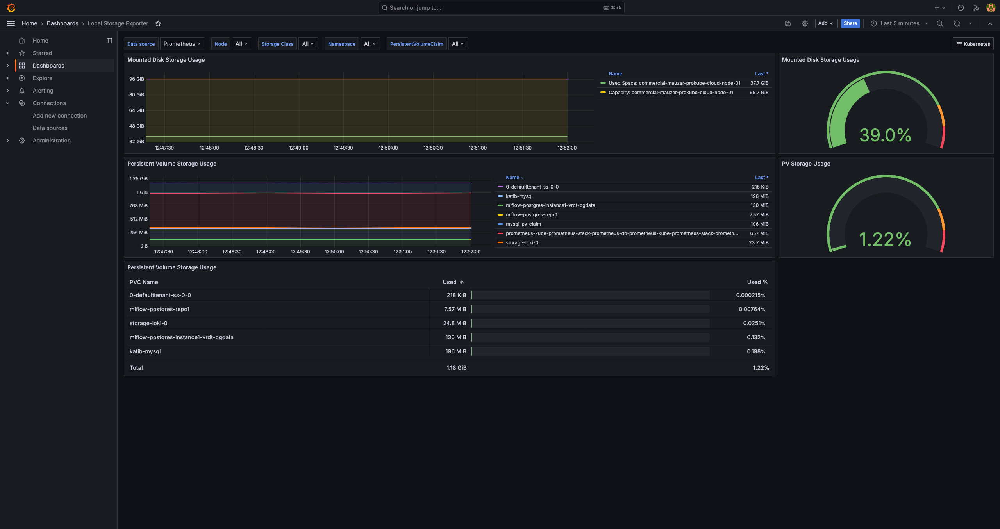

# K8s Local Storage Metrics Exporter

A Prometheus metrics exporter for Kubernetes storage providers that use host path storage, including openebs-hostpath, microk8s-hostpath, and standard storage classes for minikube, kind, and k3s. 
This exporter fills the gap left by standard Kubernetes monitoring solutions that don't provide visibility into local storage usage on worker nodes.

## Features

- Exports local storage metrics in Prometheus format
- Supports multiple storage class providers
- Configurable update intervals
- Kubernetes-native deployment via Helm
- ServiceMonitor/PodMonitor for Prometheus Operator integration
- Grafana dashboard included

## Quick Start

### Prerequisites

- Kubernetes cluster
- Docker/container registry access
- Helm 3.x

### Build and Push Container Image

```bash
REGISTRY=my-registry
# first docker login if needed
docker build -t ${REGISTRY}/local-storage-exporter:latest --platform=linux/amd64 . # change the platform and tag according to your needs
docker push ${REGISTRY}/local-storage-exporter:latest
```

Github Actions will automatically build and push the image and the helm chart to the GitHub Container Registry (GHCR) when changes are pushed to the `main` branch.

### Deploy with Helm

Create a `values.yaml` file:
```yaml
# Storage classes to monitor
storageClassNames: 
  - openebs-hostpath

# Host paths where PVs are stored
storagePaths: 
  - /var/openebs/local/

# Container image configuration
image:
  repository: ghcr.io/prokube/local-storage-exporter # Or your custom registry/repo
  tag: latest
  pullPolicy: IfNotPresent

# Private registry authentication (optional)
imagePullSecrets:
  - name: your-registry-secret

# Metrics configuration
metricsPort: 9100
updateInterval: 15s
logLevel: info

# Prometheus Operator integration (requires prometheus-operator)
serviceMonitor:
  enabled: true
  interval: 30s
  scrapeTimeout: 10s

# Alternative: PodMonitor instead of ServiceMonitor
podMonitor:
  enabled: false
  interval: 30s
  scrapeTimeout: 10s

# DaemonSet mode (recommended - runs on all nodes)
daemonSet:
  enable: true
  nodeSelector: {}
  tolerations: []

# Deployment mode (alternative to DaemonSet)
deployment:
  enable: false
  replicas: 1
  nodeSelector: {}
  tolerations: []

# Exclude specific nodes from scheduling (by hostname)
excludeNodes: []
# excludeNodes:
#   - node1
#   - node2
```

Install the Helm chart:
```bash
# --create-namespace if namespace does not exist
helm install -n <namespace> <release-name> ./helm_chart \
  --create-namespace \
  --values=values.yaml
```

### Verify Installation

Port-forward to test the metrics endpoint:
```bash
kubectl port-forward -n <namespace> svc/<release-name>-local-storage-exporter-service 9100:9100
curl http://localhost:9100/metrics
```

If ServiceMonitor is enabled and Prometheus Operator is running, metrics will automatically be scraped by Prometheus.

## Tested Storage Providers

| Storage Provider | StorageClass      | Path on Node                              |
| ---------------- | ----------------- | ----------------------------------------- |
| openebs          | openebs-hostpath  | /var/openebs/local                        |
| microk8s         | microk8s-hostpath | /var/snap/microk8s/common/default-storage |
| kind             | standard          | /var/local-path-provisioner               |
| minikube         | standard          | /tmp/hostpath-provisioner                 |
| k3s              | standard          | /var/lib/rancher/k3s/storage/             |


## Grafana Dashboard

A grafana dashboard is included as [local-storage-exporter-grafana.json](/local-storage-exporter-grafana.json). You can import it into your Grafana instance to visualize the metrics collected by the exporter. 

